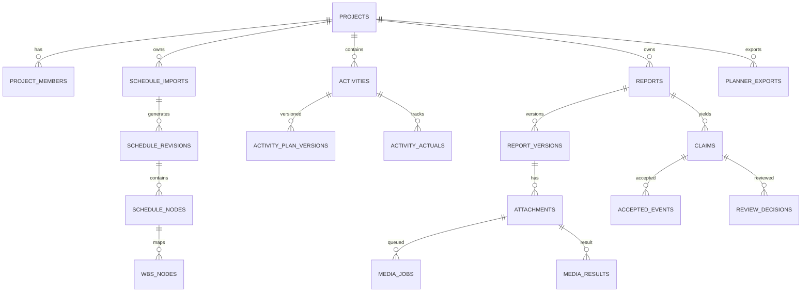
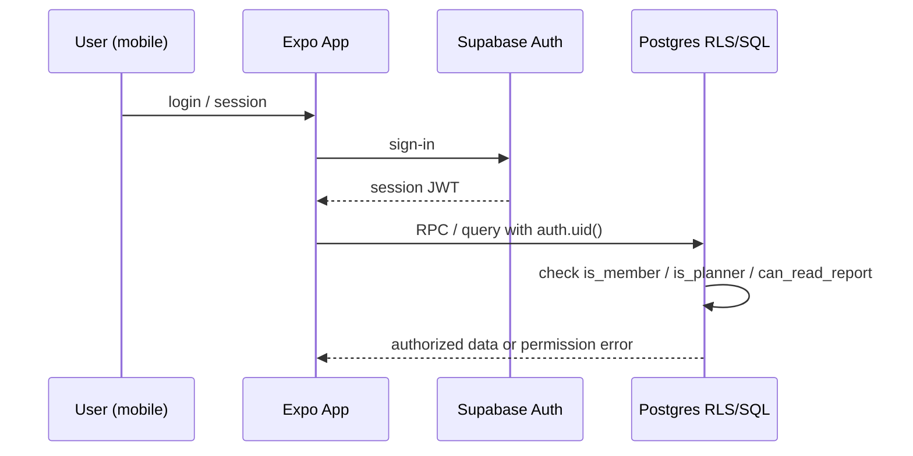
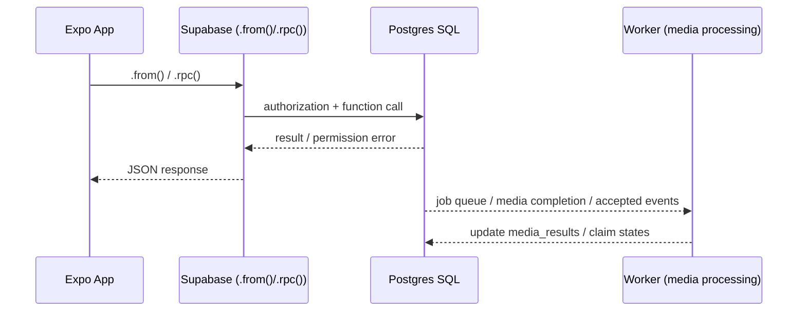
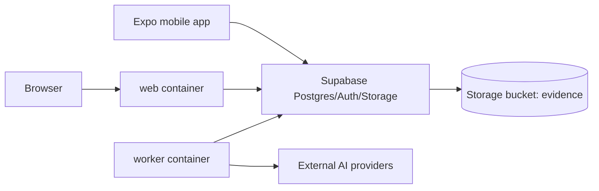

# ARCHITECTURE.md — System Diagrams (from the existing web app)

These are recreated from the web app's own architecture diagrams so Codex has
them as text/Mermaid instead of images. Mobile is a **new client** against
the **same backend** — nothing here changes; mobile just adds another arrow
into the same Supabase project.

## 1. Entity relationships

## 2. Auth / read flow (mobile must replicate this exactly)

## 3. Write flow (report submission, claim decisions, exports)

Mobile never talks to the worker directly. It writes through Supabase, the
worker picks up queued jobs (`media_jobs`) asynchronously, and mobile learns
the outcome by re-reading `media_results` / report status (poll or Realtime
subscription — see `CODEX.md` §5 open questions).

## 4. Deployment (reference only — mobile doesn't run any of this)

Web + worker run in Docker. Mobile is an additional client of the same
Supabase project — it uploads evidence to the same `evidence` bucket and is
subject to the same RLS policies as the web app; there is no separate mobile
backend to build.

## 5. What this means for the mobile build

- Every mobile screen maps to an existing table/RPC/API route — see
  `CODEX.md` §3 and `FEATURES.md`. If a screen needs something not
  listed there, stop and ask before inventing a backend contract.
- Auth must produce the same JWT / `auth.uid()` that RLS policies check —
  use Supabase Auth's mobile SDK flow, not a custom auth scheme.
- Anything async (media processing, claim verification) is eventually
  consistent from the mobile client's point of view — always show an
  explicit pending/processing state, never assume an immediate result.
