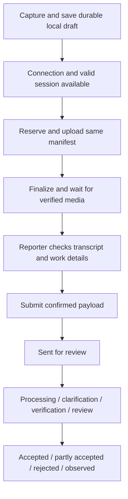

# Mobile project discovery

Reviewed 23 September 2026. Roadmap 0.3 adds the approved Field/Manager navigation shell, protected routes, shared auth lifecycle and project-selection placeholder to the foundation and auth slices. The owner confirmed Nirmaan branding, the production backend and this slice's navigation. See the [navigation draft](pr-drafts/0.3-navigation-shell.md), [auth draft](pr-drafts/0.2-auth-session.md) and [foundation draft](pr-drafts/0.1-project-foundation.md) for separate validation evidence and limitations. Production login and physical-device behavior remain unverified. Other product and architecture decisions remain open. No APK has been built.

## Sources inspected

- All seven original Markdown files in this repository: AGENTS.md, CODEX.md, ARCHITECTURE.md, FEATURES.md, ROADMAP.md, RULES.md and README.md.
- All 12 pages of [the Nirmaan design book](../Nirmaan-Website-and-Mobile-Design%20%281%29.pdf), including rendered layouts.
- The single wide page of [Untitled.pdf](../Untitled.pdf), containing eight mobile reference screens.
- [The web MVP](https://github.com/ShivenduShivu/SIH122), pinned for this review to commit `c779472cced97006856cfc186c955f69ad7d15ab`. A separate temporary checkout was used; the existing local web checkout was left unchanged.
- Web README, architecture alignment v1.2, design-fidelity notes, media/operations documentation, auth helpers, contract schemas, relevant routes and SQL migrations.

The original mobile docs are at the repository root, although several existing links say `docs/`. Their data-model descriptions are a starting point, not generated schema types or proof of a deployed environment.

## Product understanding

The product connects construction field evidence to a planner's accepted schedule. A worker or supervisor records what happened, including dates, quantities, location and unfinished work. A server worker transcribes audio and extracts claims. Matching proposes existing activities; missing facts and conflicting evidence remain visible. Authorized people clarify, verify and accept changes. Only accepted events update actuals and execution history.

The APK is a native React Native/Expo client of this same system. It adds durable offline capture and a compact manager view. It does not run the extraction worker, make autonomous schedule decisions, import schedules, or imply a verified Primavera integration.

Roles in the actual database are `reporter`, `supervisor`, `planner` and `manager`. Field/Manager are presentation groupings; a persona switch must never grant authority beyond active project membership and existing RLS/RPC checks.

The web product is called **IntelliGrid**. On 23 September 2026, the owner confirmed **Nirmaan** as the mobile app name, retaining the mobile design book's identity.

## Design baseline

The primary PDF governs the visual language. Untitled.pdf contributes capture, hierarchy and manager interaction ideas; its SitePulse identity, bright palette and illustrative percentages are not the mobile baseline.

The web implementation retains these primary-design tokens:

| Role                               | Existing value |
| ---------------------------------- | -------------- |
| Navy headings and primary controls | `#17354c`      |
| Accent                             | `#266b8c`      |
| Paper                              | `#ffffff`      |
| Page ground                        | `#f2f4f5`      |
| Thin rules                         | `#d7e0e5`      |
| Secondary text                     | `#627786`      |

Web body text uses Segoe UI/Arial and headings use Georgia/Times New Roman. Exact Android font assets/fallbacks remain to be selected and reviewed; these web fonts must not be assumed present on Android.

Preserve:

- A formal masthead, left-aligned serif headings, plain data labels and small outline icons.
- A real project/person context and honest connection/delivery banner.
- Current work with activity ID, location and accepted quantity. Show “2 of 8 spools accepted”; do not substitute an overall completion score.
- One primary voice action, with Type instead and Add a photo beneath it.
- The Report → Check → Send sequence, editable wording, work date and explicit unfinished work.
- Loading, empty, retry/error, offline, denied-permission and expired-session states.
- Missing values as “Not recorded”; no fabricated dates, zeroes, reviewer names, sync times or sample success.
- Large touch targets, font scaling, readable Hindi, safe areas and keyboard-safe forms.

Proposed field layout, pending navigation approval:

```text
Brand / active project             Language / account
Connection and delivery state
Greeting / current assignment
Activity record + accepted quantity
Speak a progress report
Type instead                 Add a photo
Recent report outcome
Home | Report | My work | My reports
```

On 23 September 2026, the owner approved these four field tabs and the compact Manager tabs Overview / Review / Schedule / History, with account/project controls in the header and Alerts deferred for step 0.3. [The approved proposal](NAVIGATION_PROPOSAL.md) records the shell scope. ROADMAP 0.3 now reflects that decision; languages, v1 Alerts/push scope and business transport remain open.

Map the manager view to pages 2–7: pending decisions first, original evidence and candidate explanations, exact proposed changes, accepted records and a read-only schedule. A task hierarchy follows actual parent relationships, not invented fixed L5/L6 levels. No aggregate percentage or health score without a defined supported basis.

## Code-backed integration findings

Paths in this section refer to the pinned web source.

| Mobile concern           | Existing contract                                                                            | Consequence                                                                                                                                                 |
| ------------------------ | -------------------------------------------------------------------------------------------- | ----------------------------------------------------------------------------------------------------------------------------------------------------------- |
| Authentication           | Supabase password auth; web uses cookie sessions in `apps/web/src/lib/supabase.ts`           | Native auth can use the same project with SecureStore; user provision/access must already exist.                                                            |
| Project access           | `project_members` with active membership and four scoped roles                               | Project and persona choices derive from authorized records.                                                                                                 |
| Schedule                 | `schedule_snapshot(p_project)`                                                               | Reuse its coherent revision, hierarchy, activity and accepted-actuals data.                                                                                 |
| Assignments              | `assignment_versions`, read in stable pages by the web client                                | There is no generic “assignments” table to invent. Latest version and access/effective-date semantics need careful matching.                                |
| Reserve capture          | `reserve_field_capture(p_project, p_capture, p_files, p_language)`                           | Persist the stable capture ID and exact manifest before retries. Returns a report ID, which differs from the client capture ID.                             |
| Upload                   | Private `evidence` bucket, reserved attachment paths, no overwrite                           | Preserve bytes, MIME, size and SHA-256. Upload authority comes from the signed-in user.                                                                     |
| Finalize                 | `finalize_field_media(p_report)`                                                             | Enqueues validation/transcription; this is still a draft, not a report sent for review.                                                                     |
| Processing               | `media_jobs`, `media_results`, `attachments`                                                 | Read permitted fields only. Mobile never calls worker-only `lease_field_media` or `complete_field_media`.                                                   |
| Submit                   | `submit_field_capture(p_report, p_text, p_work_date, p_activity)`                            | Requires ready media and confirmed text; immutable submission retries must retain their original payload.                                                   |
| Planner acceptance       | `preview_claim(p_command)`, then `decide_claim(p_command)`                                   | Preserve preview hash and expected report/run/claim/plan/actuals/policy versions. A stale preview must be refreshed.                                        |
| Independent verification | `request_verification(p_claim, p_command)`, `decide_verification(p_request, p_command)`      | Separate supervisor attestation from planner acceptance; do not treat the mobile docs' two verification routes as accept/reject.                            |
| Clarification            | `request_clarification`, `respond_clarification` and existing question records               | Preserve the original wording and handle answer-needed states.                                                                                              |
| History                  | `execution_history(p_project)`                                                               | Accepted evidence stays inspectable.                                                                                                                        |
| Export                   | `create_planner_export(p_project, p_command, p_revision, p_version)` plus web download route | Snapshot creation and web ZIP generation are separate; the current code does not expose the generic queued/generating workflow described by the mobile kit. |

### Native API transport is an open decision

The current web `apiSession(request)` checks same-origin for mutations and reads Supabase session cookies. It does not consume a native Bearer token. Copying those route URLs into the APK will not provide end-to-end authentication.

Recommendation for approval: use already-granted authenticated Supabase reads/RPCs for the mobile core, preserving contract validation and database authority. Server-side export downloads need a separately coordinated authenticated web transport. Alternative: add tested Bearer-token support in the web project while retaining browser CSRF checks. No web code, auth policy or backend schema has been changed.

### Audio is a real compatibility gate

The actual media contract allows one mono PCM16 WAV recording of 0.2–25 seconds, supported sample rates of 16/22.05/24/44.1/48 kHz, and at most 5 MB. Up to three JPEG/PNG/WebP photos are allowed, at most 5 MB each and 20 million decoded pixels. The worker verifies bytes, not just the filename.

The repo's `expo-av` recommendation is outdated: it was removed in SDK 55. The replacement recorder's documented Android encoders/containers do not include PCM WAV. Renaming an M4A file to WAV does not solve this. See [Expo's SDK 55 migration notes](https://expo.dev/blog/upgrading-to-sdk-55) and [Android recording options](https://docs.expo.dev/versions/latest/sdk/audio/).

Options requiring the owner's choice:

1. Evaluate a native WAV recorder in an Expo development build, retaining the backend.
2. Coordinate an explicit backend contract/decoder extension for Android audio.
3. Ship text/photo first while voice remains a separately blocked slice.

Do not choose a library or claim Expo Go supports the complete voice flow before a recorded-byte probe and Android device test.

### Offline capture must preserve confirmation

Proposed sequence:



Offline voice cannot show a server transcript that has not been produced. Recommend automatic upload after reconnect, followed by explicit transcript confirmation before submission. Already-confirmed text/photo submissions can resume their stable queued payload. Confirm this interaction before implementing it.

Recommendation for review: SQLite stores the outbox state and immutable retry identifiers; app-private durable files store media. Partition drafts and query caches by user/project. Do not delete unsent work on logout without a clear owner-approved policy. Clear local evidence only after a durable, recoverable server handoff. Persist before displaying “Saved on device”; a failed disk write must remain visible.

Foreground reconnect/resume and an explicit Sync now control can be verified independently of OS background execution. Do not promise guaranteed background sync while the app is closed.

The web status helper includes Partly accepted, Answer needed, Supervisor check, Observed, Unplanned, Withdrawn and processing failures. The APK must retain those distinctions rather than map every received report to Accepted.

### Production backend confirmed; connectivity verification pending

On 23 September 2026, the owner selected the existing production backend: web app https://intelligrid-sih122.vercel.app and Supabase project `dgxflhdcthyborxjyfvv`. D2 is resolved; this choice does not resolve the separate native transport decision (D5).

For local web development, use the web checkout's ignored `apps/web/.env.local`, with `APP_ORIGIN=http://localhost:3000` and the exact variables `NEXT_PUBLIC_SUPABASE_URL` and `NEXT_PUBLIC_SUPABASE_PUBLISHABLE_KEY`. The Supabase URL is supplied locally in that file. The owner will supply the publishable/anon key locally from Supabase Dashboard > Project Settings > API; the provided message contained a placeholder, not a usable key. Do not put passwords, service-role keys, signing keys or other private secrets in this file or the mobile bundle.

Roadmap 0.2 reads the same two public variables from the mobile root `.env.local`, through `app.config.ts` and Expo Constants. That ignored local file contains the production URL with a blank key. Native tokens use SecureStore; the browser preview uses memory only. Direct Supabase password authentication follows the already specified auth flow. This does not resolve D5 for business reads/RPCs or web API transport.

The local web checkout is `C:\Users\Mahak\SIH-122`; SIH-APP has no web application directory. Backend reachability, signed-in access, deployed migrations, worker processing and physical-phone connectivity have not been verified. A phone cannot reach the laptop backend through its own localhost.

Realtime is enabled in the local Supabase configuration, but the reviewed migrations do not establish the required table publication. Recommend foreground polling initially, pending owner confirmation, and pause polling when inactive/offline. Do not silently promise Realtime.

## Decision register

| ID  | Decision                            | Proposed direction                                                                 | Status                                                          |
| --- | ----------------------------------- | ---------------------------------------------------------------------------------- | --------------------------------------------------------------- |
| D1  | APK brand                           | Nirmaan                                                                            | Confirmed by owner, 23 September 2026                           |
| D2  | Target backend                      | Existing production web app and Supabase project; local `.env.local` configuration | Confirmed by owner, 23 September 2026; publishable key pending  |
| D3  | Field and Manager navigation        | Approved tabs and shared header in `NAVIGATION_PROPOSAL.md`                        | Confirmed by owner, 23 September 2026                           |
| D4  | Languages and Alerts                | English + Hindi; v1 Alerts/push scope still open                                   | Alerts deferred for 0.3 by owner; remaining scope unanswered    |
| D5  | Native transport                    | Existing authenticated Supabase RPCs                                               | Asked                                                           |
| D6  | Android audio                       | Evaluate native WAV with a development build                                       | Asked                                                           |
| D7  | Offline voice confirmation          | Auto-upload, then explicit transcript confirmation                                 | Asked                                                           |
| D8  | Iteration cadence                   | Small tested slices; major-feature PRs; owner reviews merges                       | Asked                                                           |
| D9  | Commit signing                      | Owner's configured GPG key ending in `831C481EF8506935`                            | Local key and signing configuration verified, 23 September 2026 |
| D10 | Outbox storage and logout retention | SQLite + durable media; explicit unsent-work policy                                | Review before outbox slice                                      |
| D11 | Status refresh                      | Foreground polling until Realtime is verified                                      | Review before status slice                                      |
| D12 | Android identity/build ownership    | Package ID, Expo owner/build path and APK signing custody                          | Review before first distributable build                         |

Unanswered questions are not approvals. Preparatory documentation can proceed; dependent implementation waits.

## Proposed implementation and verification order

1. Resolve the decisions needed for the foundation; implement roadmap 0.1 only: Expo/TypeScript, strict checks, Jest, minimal branded launch screen and CI.
2. Authentication/session restore and authorized navigation/project context (0.2–0.3).
3. Field work, supported capture, confirmation and durable delivery/status (1.1–1.6).
4. Project switching and authorized hierarchy (2.1–2.2).
5. Manager review with exact preview/acceptance and separate verification (3.1–3.2, amended spec).
6. Read-only active schedule (4.1).
7. Exports after transport agreement (5.1); supported manager aggregates (6.1).
8. Optional Alerts only after scope and backend contract approval.
9. Produce and install an APK, complete the agreed cross-client and airplane-mode checks against the owner-selected backend, and document remaining physical-device limitations.

Each slice follows [the development workflow](DEVELOPMENT_WORKFLOW.md). No unimplemented slice is complete merely because it has a placeholder screen.
